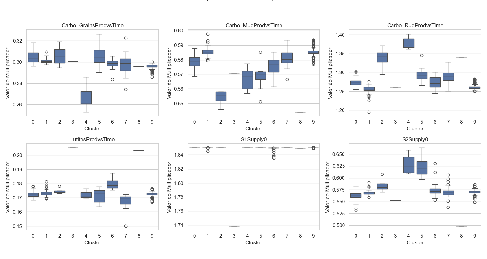

# Relatório de Análise de Calibração

Relatório gerado em: 2025-10-29 14:31:00

Arquivo de entrada: `5Pocos_SemEustasia.xlsx`

## Resumo das Configurações da Análise

* **Percentil para Melhores Modelos:** 30%
* **Variância Mantida pelo PCA:** 95%
* **Número de Componentes Principais:** 5
* **Número de Clusters (k):** 10

## Seleção dos Melhores Modelos

Total de simulações: 1435
Número de modelos selecionados (melhores 30%): 431

*Gráfico 1: Dispersão dos valores da Função Objetivo (OF). Pontos laranjas indicam os modelos selecionados.*

## Determinação do Número de Clusters (k)

Foram analisados valores de k no intervalo: [2, 3, 4, 5, 6, 7, 8, 9, 10]

*Gráfico 2: Método do Cotovelo (Inércia vs. k). O 'cotovelo' sugere um k ótimo.*

*Gráfico 3: Pontuação Média de Silhueta vs. k. Valores mais altos indicam melhor separação dos clusters.*

**Número de clusters escolhido (k): 10**

## Visualização e Análise dos Clusters

*Gráfico 4: Visualização dos 10 clusters no espaço dos dois primeiros Componentes Principais (Total Var. Explicada: 59.2%).*

### Tamanho dos Clusters

|   Cluster |   Número de Modelos |
|----------:|--------------------:|
|         0 |                  46 |
|         1 |                  92 |
|         2 |                   4 |
|         3 |                   1 |
|         4 |                   5 |
|         5 |                  11 |
|         6 |                  31 |
|         7 |                  32 |
|         8 |                   1 |
|         9 |                 208 |

### Centróides dos Clusters (Valores Médios dos Parâmetros Originais)

|   Cluster |   Carbo_GrainsProdvsTime |   Carbo_MudProdvsTime |   Carbo_RudProdvsTime |   LutitesProdvsTime |   S1Supply0 |   S2Supply0 |
|----------:|-------------------------:|----------------------:|----------------------:|--------------------:|------------:|------------:|
|         0 |                   0.3043 |                0.5783 |                1.2734 |              0.1724 |      1.8500 |      0.5620 |
|         1 |                   0.3009 |                0.5851 |                1.2545 |              0.1732 |      1.8499 |      0.5686 |
|         2 |                   0.3063 |                0.5542 |                1.3382 |              0.1748 |      1.8500 |      0.5845 |
|         3 |                   0.3015 |                0.5715 |                1.2651 |              0.2056 |      1.7388 |      0.5525 |
|         4 |                   0.2657 |                0.5655 |                1.3731 |              0.1717 |      1.8499 |      0.6291 |
|         5 |                   0.3061 |                0.5686 |                1.2948 |              0.1712 |      1.8500 |      0.6231 |
|         6 |                   0.2987 |                0.5755 |                1.2725 |              0.1797 |      1.8485 |      0.5743 |
|         7 |                   0.2979 |                0.5806 |                1.2888 |              0.1673 |      1.8500 |      0.5705 |
|         8 |                   0.2952 |                0.5427 |                1.3372 |              0.2031 |      1.8494 |      0.4980 |
|         9 |                   0.2962 |                0.5856 |                1.2618 |              0.1727 |      1.8500 |      0.5705 |
*Tabela 1: Valores médios dos multiplicadores para cada cluster.*

### Estatísticas da Função Objetivo ('OF Value') por Cluster

|   Cluster |    count |   mean |      std |    min |    25% |    50% |    75% |    max |
|----------:|---------:|-------:|---------:|-------:|-------:|-------:|-------:|-------:|
|         0 |  46.0000 | 0.3208 |   0.0044 | 0.3158 | 0.3168 | 0.3204 | 0.3251 | 0.3291 |
|         1 |  92.0000 | 0.3196 |   0.0037 | 0.3156 | 0.3157 | 0.3209 | 0.3217 | 0.3294 |
|         2 |   4.0000 | 0.3202 |   0.0033 | 0.3175 | 0.3176 | 0.3195 | 0.3221 | 0.3243 |
|         3 |   1.0000 | 0.3240 | nan      | 0.3240 | 0.3240 | 0.3240 | 0.3240 | 0.3240 |
|         4 |   5.0000 | 0.3215 |   0.0031 | 0.3181 | 0.3182 | 0.3232 | 0.3235 | 0.3246 |
|         5 |  11.0000 | 0.3224 |   0.0035 | 0.3177 | 0.3188 | 0.3240 | 0.3250 | 0.3261 |
|         6 |  31.0000 | 0.3223 |   0.0043 | 0.3165 | 0.3179 | 0.3228 | 0.3261 | 0.3288 |
|         7 |  32.0000 | 0.3224 |   0.0043 | 0.3168 | 0.3178 | 0.3220 | 0.3261 | 0.3292 |
|         8 |   1.0000 | 0.3294 | nan      | 0.3294 | 0.3294 | 0.3294 | 0.3294 | 0.3294 |
|         9 | 208.0000 | 0.3194 |   0.0037 | 0.3155 | 0.3156 | 0.3207 | 0.3210 | 0.3294 |
*Tabela 2: Estatísticas descritivas do 'OF Value' para os modelos dentro de cada cluster.*

### Distribuição dos Parâmetros por Cluster

*Gráfico 5: Boxplots mostrando a distribuição dos valores de cada parâmetro (multiplicador) dentro de cada cluster.*

## Seleção dos Modelos Representativos ('Campeões' por Cluster)

A tabela abaixo mostra a simulação com o menor 'OF Value' dentro de cada um dos clusters identificados.

| Simulation_ID   |   Carbo_GrainsProdvsTime |   Carbo_MudProdvsTime |   Carbo_RudProdvsTime |   LutitesProdvsTime |   S1Supply0 |   S2Supply0 |   OF Value |   Simulation |   Cluster |
|:----------------|-------------------------:|----------------------:|----------------------:|--------------------:|------------:|------------:|-----------:|-------------:|----------:|
| Sim1075         |                   0.3007 |                0.5829 |                1.2679 |              0.1751 |      1.8500 |      0.5560 |     0.3158 |    1075.0000 |    0.0000 |
| Sim1204         |                   0.2985 |                0.5848 |                1.2547 |              0.1727 |      1.8500 |      0.5663 |     0.3156 |    1204.0000 |    1.0000 |
| Sim704          |                   0.3005 |                0.5581 |                1.3454 |              0.1738 |      1.8500 |      0.5814 |     0.3175 |     704.0000 |    2.0000 |
| Sim1011         |                   0.3009 |                0.5702 |                1.2614 |              0.2052 |      1.7387 |      0.5522 |     0.3240 |    1011.0000 |    3.0000 |
| Sim923          |                   0.2607 |                0.5683 |                1.3898 |              0.1698 |      1.8500 |      0.6234 |     0.3181 |     923.0000 |    4.0000 |
| Sim907          |                   0.3041 |                0.5718 |                1.2873 |              0.1689 |      1.8500 |      0.6165 |     0.3177 |     907.0000 |    5.0000 |
| Sim1151         |                   0.2979 |                0.5798 |                1.2611 |              0.1792 |      1.8375 |      0.5612 |     0.3165 |    1151.0000 |    6.0000 |
| Sim825          |                   0.2994 |                0.5845 |                1.2795 |              0.1667 |      1.8500 |      0.5618 |     0.3168 |     825.0000 |    7.0000 |
| Sim558          |                   0.2958 |                0.5440 |                1.3410 |              0.2035 |      1.8495 |      0.4983 |     0.3294 |     558.0000 |    8.0000 |
| Sim1349         |                   0.2961 |                0.5853 |                1.2591 |              0.1735 |      1.8500 |      0.5726 |     0.3155 |    1349.0000 |    9.0000 |
*Tabela 3: Melhores simulações representativas de cada cluster.*

