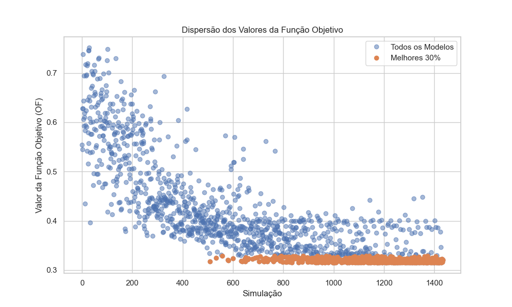
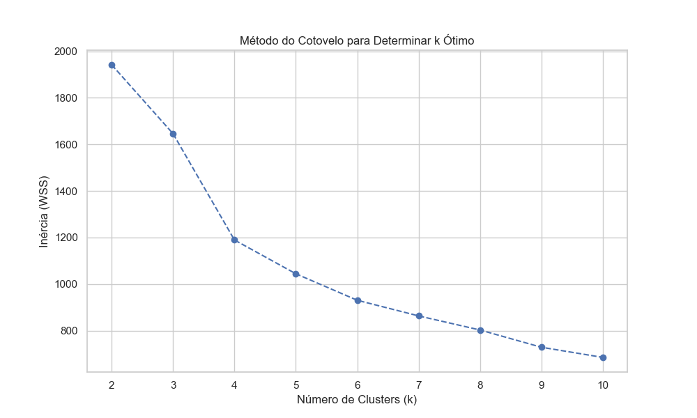
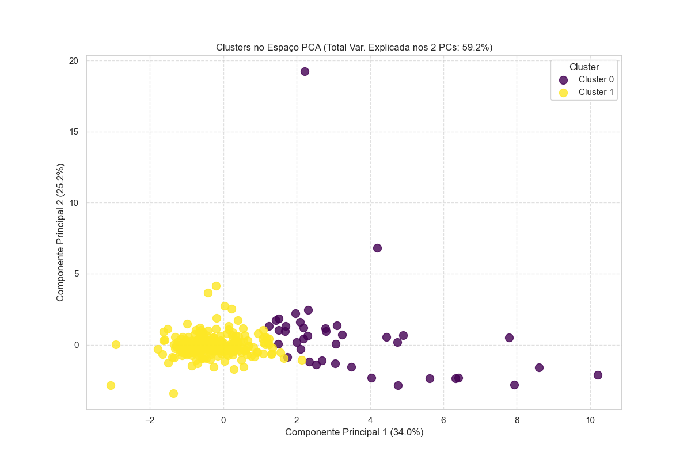

# Relatório de Análise de Calibração

Relatório gerado em: 2025-10-28 16:13:19

Arquivo de entrada: `5Pocos_SemEustasia.xlsx`

## Resumo das Configurações da Análise

* **Percentil para Melhores Modelos:** 30%
* **Variância Mantida pelo PCA:** 95%
* **Número de Componentes Principais:** 5
* **Número de Clusters (k):** 2

## Seleção dos Melhores Modelos

Total de simulações: 1435
Número de modelos selecionados (melhores 30%): 431

*Gráfico 1: Dispersão dos valores da Função Objetivo (OF). Pontos laranjas indicam os modelos selecionados.*

## Determinação do Número de Clusters (k)

Foram analisados valores de k no intervalo: [2, 3, 4, 5, 6, 7, 8, 9, 10]

*Gráfico 2: Método do Cotovelo (Inércia vs. k). O 'cotovelo' sugere um k ótimo.*

*Gráfico 3: Pontuação Média de Silhueta vs. k. Valores mais altos indicam melhor separação dos clusters.*

**Número de clusters escolhido (k): 2**

## Visualização e Análise dos Clusters

*Gráfico 4: Visualização dos 2 clusters no espaço dos dois primeiros Componentes Principais (Total Var. Explicada: 59.2%).*

### Tamanho dos Clusters

