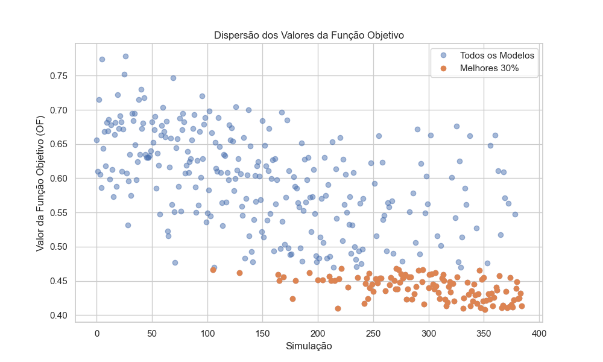
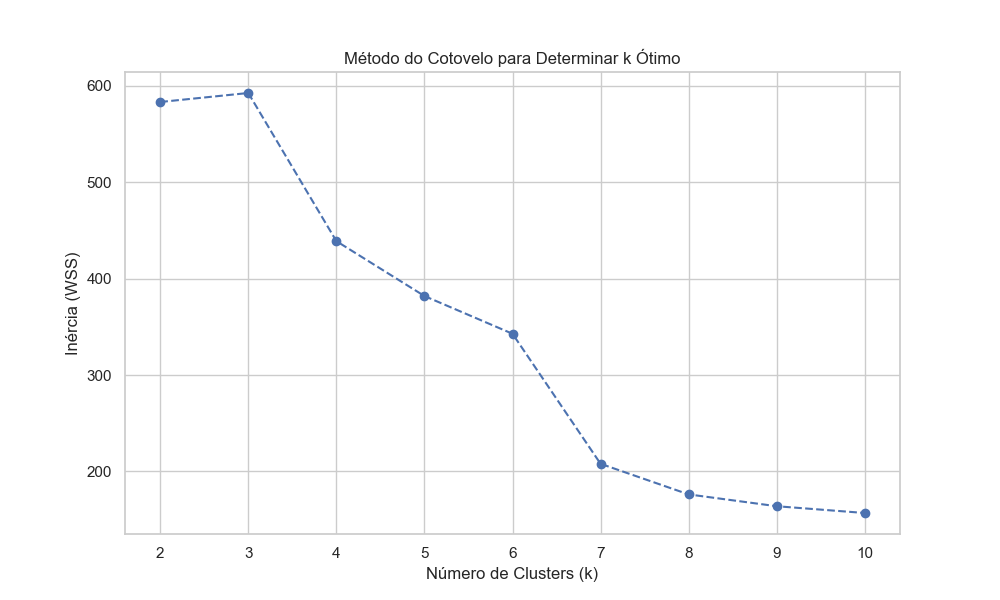
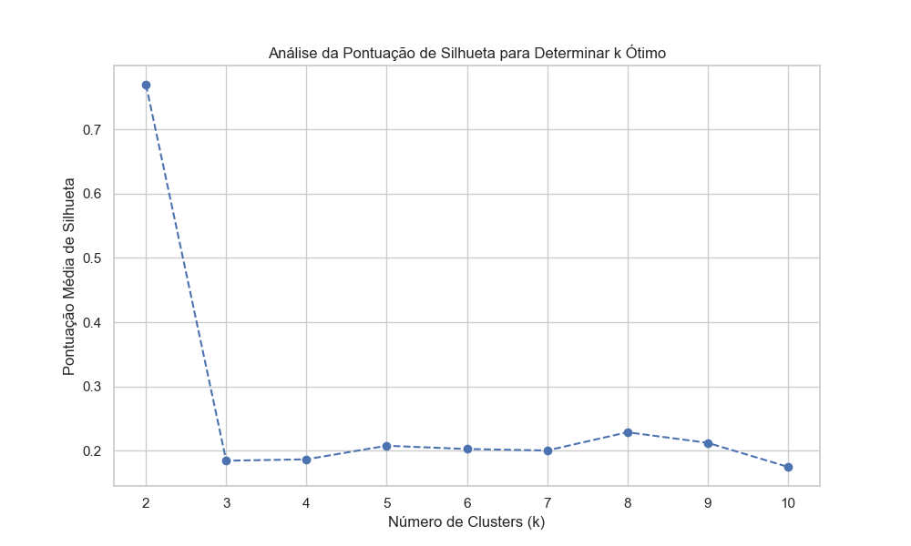
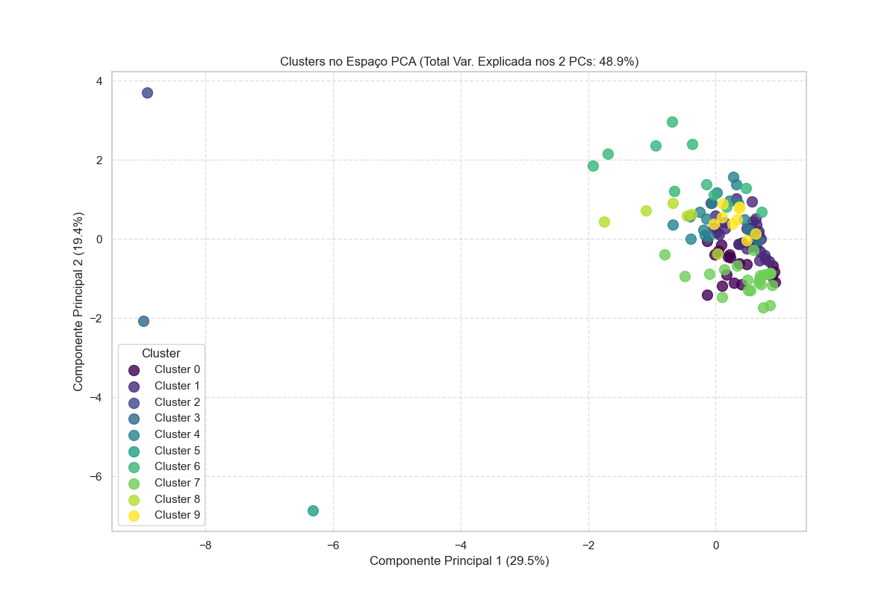
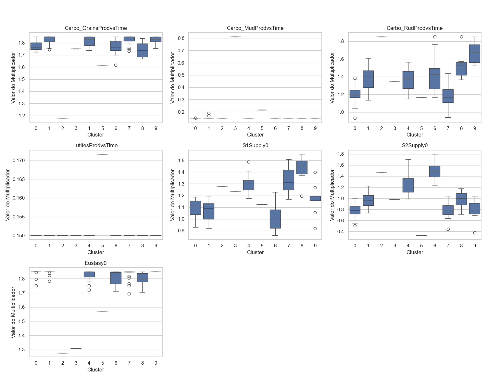

# Relatório de Análise de Calibração

Relatório gerado em: 2025-10-29 15:33:31

Arquivo de entrada: `5_well_7param_RangeMaior_35x10.xlsx`

## Resumo das Configurações da Análise

* **Percentil para Melhores Modelos:** 30%
* **Variância Mantida pelo PCA:** 95%
* **Número de Componentes Principais:** 6
* **Número de Clusters (k):** 10

## Seleção dos Melhores Modelos

Total de simulações: 385
Número de modelos selecionados (melhores 30%): 116

*Gráfico 1: Dispersão dos valores da Função Objetivo (OF). Pontos laranjas indicam os modelos selecionados.*

## Determinação do Número de Clusters (k)

Foram analisados valores de k no intervalo: [2, 3, 4, 5, 6, 7, 8, 9, 10]

*Gráfico 2: Método do Cotovelo (Inércia vs. k). O 'cotovelo' sugere um k ótimo.*

*Gráfico 3: Pontuação Média de Silhueta vs. k. Valores mais altos indicam melhor separação dos clusters.*

**Número de clusters escolhido (k): 10**

## Visualização e Análise dos Clusters

*Gráfico 4: Visualização dos 10 clusters no espaço dos dois primeiros Componentes Principais (Total Var. Explicada: 48.9%).*

### Tamanho dos Clusters

|   Cluster |   Número de Modelos |
|----------:|--------------------:|
|         0 |                  18 |
|         1 |                  31 |
|         2 |                   1 |
|         3 |                   1 |
|         4 |                  17 |
|         5 |                   1 |
|         6 |                  11 |
|         7 |                  21 |
|         8 |                   6 |
|         9 |                   9 |

### Centróides dos Clusters (Valores Médios dos Parâmetros Originais)

|   Cluster |   Carbo_GrainsProdvsTime |   Carbo_MudProdvsTime |   Carbo_RudProdvsTime |   LutitesProdvsTime |   S1Supply0 |   S2Supply0 |   Eustasy0 |
|----------:|-------------------------:|----------------------:|----------------------:|--------------------:|------------:|------------:|-----------:|
|         0 |                   1.7828 |                0.1462 |                1.2022 |              0.1500 |      1.0893 |      0.7696 |     1.8332 |
|         1 |                   1.8233 |                0.1531 |                1.3792 |              0.1500 |      1.0686 |      0.9581 |     1.8492 |
|         2 |                   1.1396 |                0.1823 |                1.8439 |              0.1502 |      1.2893 |      1.4999 |     1.3446 |
|         3 |                   1.7765 |                0.7903 |                1.3475 |              0.1498 |      1.2270 |      0.9610 |     1.2624 |
|         4 |                   1.8136 |                0.1489 |                1.3738 |              0.1500 |      1.2918 |      1.2360 |     1.8215 |
|         5 |                   1.6174 |                0.2118 |                1.1676 |              0.1716 |      1.1232 |      0.3243 |     1.5557 |
|         6 |                   1.7695 |                0.1472 |                1.4310 |              0.1500 |      1.0053 |      1.4879 |     1.7995 |
|         7 |                   1.8210 |                0.1536 |                1.1862 |              0.1500 |      1.3254 |      0.7877 |     1.8375 |
|         8 |                   1.7476 |                0.1464 |                1.5361 |              0.1500 |      1.4192 |      0.9716 |     1.7880 |
|         9 |                   1.8191 |                0.1522 |                1.6842 |              0.1500 |      1.1725 |      0.7797 |     1.8545 |
*Tabela 1: Valores médios dos multiplicadores para cada cluster.*

### Estatísticas da Função Objetivo ('OF Value') por Cluster

|   Cluster |   count |   mean |      std |    min |    25% |    50% |    75% |    max |
|----------:|--------:|-------:|---------:|-------:|-------:|-------:|-------:|-------:|
|         0 | 18.0000 | 0.4300 |   0.0133 | 0.4081 | 0.4223 | 0.4252 | 0.4337 | 0.4548 |
|         1 | 31.0000 | 0.4374 |   0.0166 | 0.4097 | 0.4220 | 0.4383 | 0.4523 | 0.4609 |
|         2 |  1.0000 | 0.4663 | nan      | 0.4663 | 0.4663 | 0.4663 | 0.4663 | 0.4663 |
|         3 |  1.0000 | 0.4662 | nan      | 0.4662 | 0.4662 | 0.4662 | 0.4662 | 0.4662 |
|         4 | 17.0000 | 0.4456 |   0.0141 | 0.4107 | 0.4382 | 0.4501 | 0.4542 | 0.4681 |
|         5 |  1.0000 | 0.4666 | nan      | 0.4666 | 0.4666 | 0.4666 | 0.4666 | 0.4666 |
|         6 | 11.0000 | 0.4470 |   0.0125 | 0.4166 | 0.4409 | 0.4508 | 0.4550 | 0.4622 |
|         7 | 21.0000 | 0.4306 |   0.0176 | 0.4095 | 0.4131 | 0.4242 | 0.4454 | 0.4650 |
|         8 |  6.0000 | 0.4491 |   0.0151 | 0.4241 | 0.4426 | 0.4522 | 0.4590 | 0.4655 |
|         9 |  9.0000 | 0.4545 |   0.0087 | 0.4419 | 0.4471 | 0.4546 | 0.4617 | 0.4682 |
*Tabela 2: Estatísticas descritivas do 'OF Value' para os modelos dentro de cada cluster.*

### Distribuição dos Parâmetros por Cluster

*Gráfico 5: Boxplots mostrando a distribuição dos valores de cada parâmetro (multiplicador) dentro de cada cluster.*

## Seleção dos Modelos Representativos ('Campeões' por Cluster)

A tabela abaixo mostra a simulação com o menor 'OF Value' dentro de cada um dos clusters identificados.

| Simulation_ID   |   Carbo_GrainsProdvsTime |   Carbo_MudProdvsTime |   Carbo_RudProdvsTime |   LutitesProdvsTime |   S1Supply0 |   S2Supply0 |   Eustasy0 |   OF Value |   Simulation |   Cluster |
|:----------------|-------------------------:|----------------------:|----------------------:|--------------------:|------------:|------------:|-----------:|-----------:|-------------:|----------:|
| Sim351          |                   1.8004 |                0.1500 |                1.1579 |              0.1500 |      1.1889 |      0.9130 |     1.8500 |     0.4081 |     351.0000 |    0.0000 |
| Sim218          |                   1.7582 |                0.1500 |                1.3669 |              0.1500 |      1.1688 |      0.9381 |     1.8500 |     0.4097 |     218.0000 |    1.0000 |
| Sim105          |                   1.1799 |                0.1500 |                1.8500 |              0.1500 |      1.2756 |      1.4655 |     1.2770 |     0.4663 |     105.0000 |    2.0000 |
| Sim295          |                   1.7496 |                0.8120 |                1.3434 |              0.1500 |      1.2361 |      0.9840 |     1.3077 |     0.4662 |     295.0000 |    3.0000 |
| Sim347          |                   1.7376 |                0.1500 |                1.2108 |              0.1500 |      1.2095 |      1.1125 |     1.8346 |     0.4107 |     347.0000 |    4.0000 |
| Sim273          |                   1.6111 |                0.2169 |                1.1666 |              0.1717 |      1.1253 |      0.3296 |     1.5662 |     0.4666 |     273.0000 |    5.0000 |
| Sim242          |                   1.6179 |                0.1500 |                1.3621 |              0.1500 |      1.0897 |      1.5555 |     1.7433 |     0.4166 |     242.0000 |    6.0000 |
| Sim331          |                   1.8500 |                0.1500 |                1.0867 |              0.1500 |      1.1678 |      0.9343 |     1.8500 |     0.4095 |     331.0000 |    7.0000 |
| Sim177          |                   1.6679 |                0.1500 |                1.3650 |              0.1500 |      1.1961 |      1.0204 |     1.7037 |     0.4241 |     177.0000 |    8.0000 |
| Sim318          |                   1.8096 |                0.1500 |                1.5309 |              0.1500 |      1.1971 |      0.9109 |     1.8500 |     0.4419 |     318.0000 |    9.0000 |
*Tabela 3: Melhores simulações representativas de cada cluster.*

