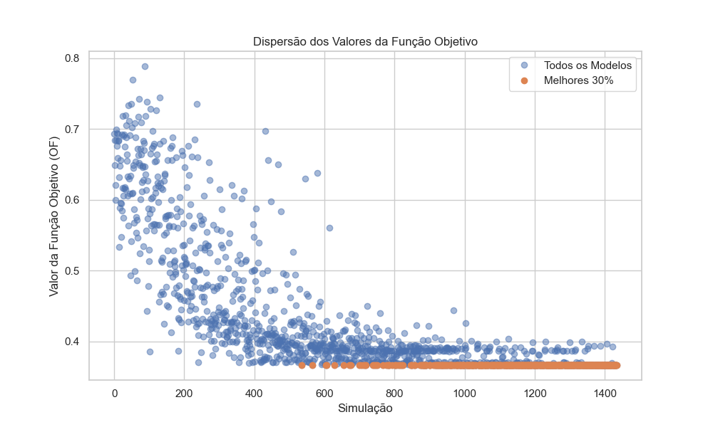
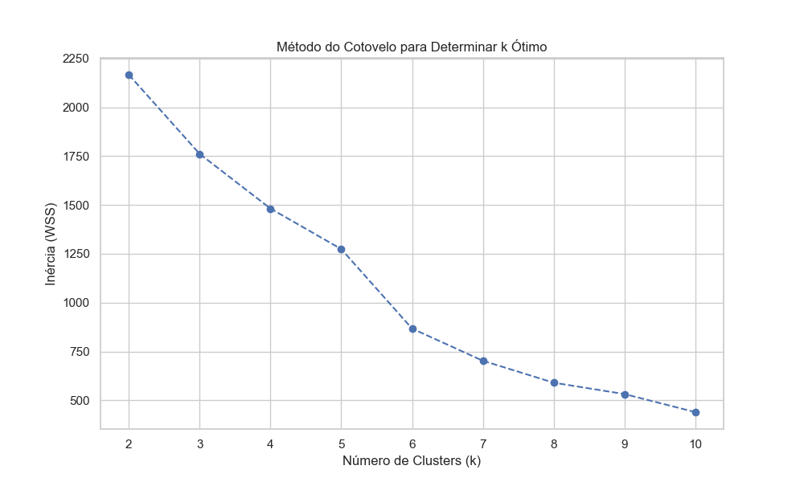
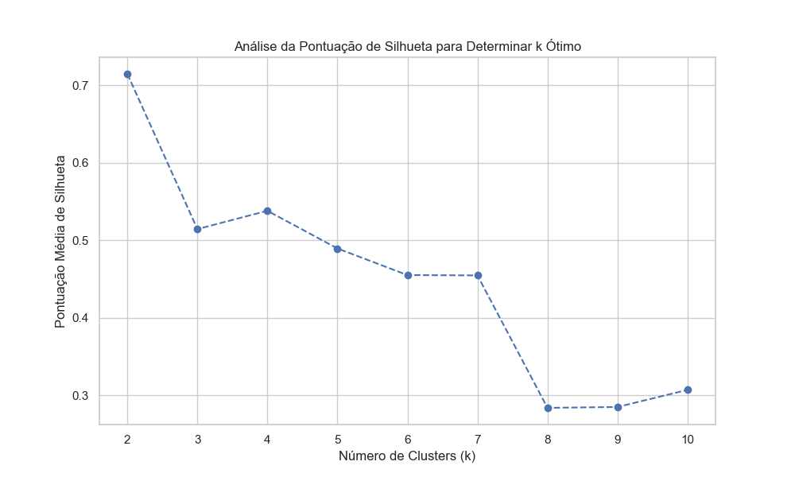
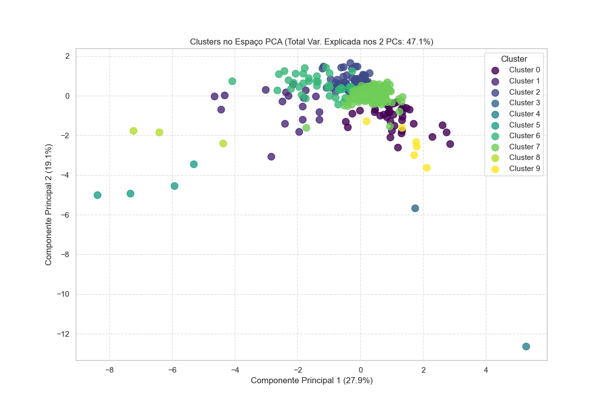
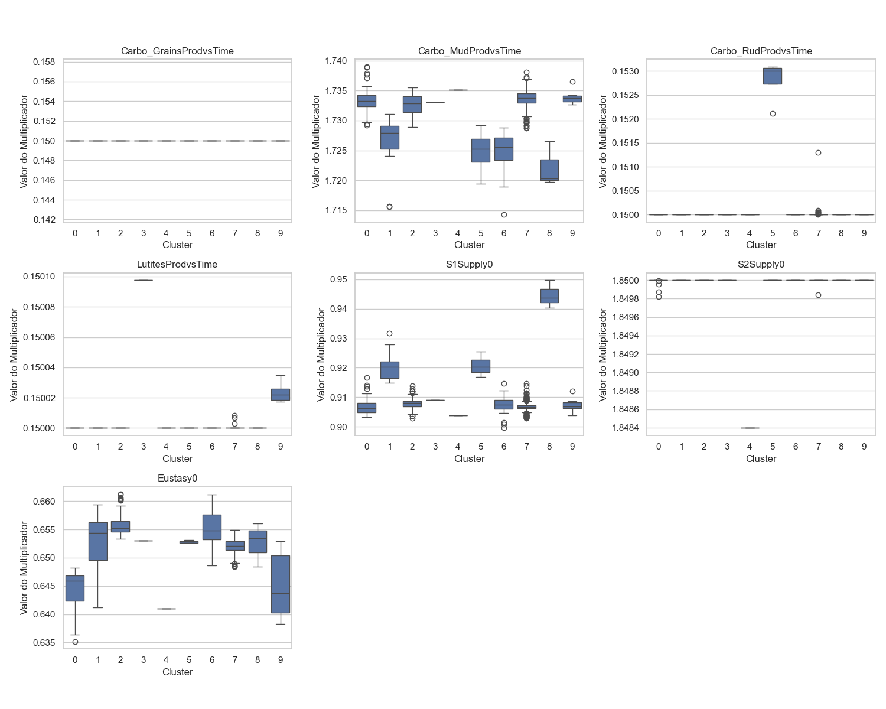

# Relatório de Análise de Calibração

Relatório gerado em: 2025-10-29 15:34:02

Arquivo de entrada: `5_well_7param_RangeMaior_35x40.xlsx`

## Resumo das Configurações da Análise

* **Percentil para Melhores Modelos:** 30%
* **Variância Mantida pelo PCA:** 95%
* **Número de Componentes Principais:** 6
* **Número de Clusters (k):** 10

## Seleção dos Melhores Modelos

Total de simulações: 1435
Número de modelos selecionados (melhores 30%): 431

*Gráfico 1: Dispersão dos valores da Função Objetivo (OF). Pontos laranjas indicam os modelos selecionados.*

## Determinação do Número de Clusters (k)

Foram analisados valores de k no intervalo: [2, 3, 4, 5, 6, 7, 8, 9, 10]

*Gráfico 2: Método do Cotovelo (Inércia vs. k). O 'cotovelo' sugere um k ótimo.*

*Gráfico 3: Pontuação Média de Silhueta vs. k. Valores mais altos indicam melhor separação dos clusters.*

**Número de clusters escolhido (k): 10**

## Visualização e Análise dos Clusters

*Gráfico 4: Visualização dos 10 clusters no espaço dos dois primeiros Componentes Principais (Total Var. Explicada: 47.1%).*

### Tamanho dos Clusters

|   Cluster |   Número de Modelos |
|----------:|--------------------:|
|         0 |                  38 |
|         1 |                  18 |
|         2 |                  77 |
|         3 |                   1 |
|         4 |                   1 |
|         5 |                   4 |
|         6 |                  38 |
|         7 |                 245 |
|         8 |                   3 |
|         9 |                   6 |

### Centróides dos Clusters (Valores Médios dos Parâmetros Originais)

|   Cluster |   Carbo_GrainsProdvsTime |   Carbo_MudProdvsTime |   Carbo_RudProdvsTime |   LutitesProdvsTime |   S1Supply0 |   S2Supply0 |   Eustasy0 |
|----------:|-------------------------:|----------------------:|----------------------:|--------------------:|------------:|------------:|-----------:|
|         0 |                   0.1500 |                1.7335 |                0.1500 |              0.1500 |      0.9071 |      1.8500 |     0.6446 |
|         1 |                   0.1500 |                1.7265 |                0.1500 |              0.1500 |      0.9205 |      1.8500 |     0.6529 |
|         2 |                   0.1500 |                1.7326 |                0.1500 |              0.1500 |      0.9080 |      1.8500 |     0.6558 |
|         3 |                   0.1500 |                1.7330 |                0.1500 |              0.1501 |      0.9090 |      1.8500 |     0.6530 |
|         4 |                   0.1500 |                1.7351 |                0.1500 |              0.1500 |      0.9039 |      1.8484 |     0.6411 |
|         5 |                   0.1500 |                1.7248 |                0.1528 |              0.1500 |      0.9208 |      1.8500 |     0.6528 |
|         6 |                   0.1500 |                1.7249 |                0.1500 |              0.1500 |      0.9074 |      1.8500 |     0.6551 |
|         7 |                   0.1500 |                1.7336 |                0.1500 |              0.1500 |      0.9068 |      1.8500 |     0.6520 |
|         8 |                   0.1500 |                1.7222 |                0.1500 |              0.1500 |      0.9446 |      1.8500 |     0.6527 |
|         9 |                   0.1500 |                1.7340 |                0.1500 |              0.1500 |      0.9074 |      1.8500 |     0.6451 |
*Tabela 1: Valores médios dos multiplicadores para cada cluster.*

### Estatísticas da Função Objetivo ('OF Value') por Cluster

|   Cluster |    count |   mean |      std |    min |    25% |    50% |    75% |    max |
|----------:|---------:|-------:|---------:|-------:|-------:|-------:|-------:|-------:|
|         0 |  38.0000 | 0.3668 |   0.0001 | 0.3667 | 0.3667 | 0.3667 | 0.3669 | 0.3671 |
|         1 |  18.0000 | 0.3668 |   0.0001 | 0.3668 | 0.3668 | 0.3668 | 0.3669 | 0.3671 |
|         2 |  77.0000 | 0.3667 |   0.0001 | 0.3667 | 0.3667 | 0.3667 | 0.3667 | 0.3670 |
|         3 |   1.0000 | 0.3667 | nan      | 0.3667 | 0.3667 | 0.3667 | 0.3667 | 0.3667 |
|         4 |   1.0000 | 0.3669 | nan      | 0.3669 | 0.3669 | 0.3669 | 0.3669 | 0.3669 |
|         5 |   4.0000 | 0.3668 |   0.0001 | 0.3668 | 0.3668 | 0.3668 | 0.3669 | 0.3669 |
|         6 |  38.0000 | 0.3668 |   0.0001 | 0.3667 | 0.3667 | 0.3667 | 0.3668 | 0.3671 |
|         7 | 245.0000 | 0.3667 |   0.0001 | 0.3666 | 0.3667 | 0.3667 | 0.3668 | 0.3671 |
|         8 |   3.0000 | 0.3671 |   0.0001 | 0.3670 | 0.3671 | 0.3671 | 0.3671 | 0.3671 |
|         9 |   6.0000 | 0.3668 |   0.0002 | 0.3667 | 0.3667 | 0.3667 | 0.3669 | 0.3670 |
*Tabela 2: Estatísticas descritivas do 'OF Value' para os modelos dentro de cada cluster.*

### Distribuição dos Parâmetros por Cluster

*Gráfico 5: Boxplots mostrando a distribuição dos valores de cada parâmetro (multiplicador) dentro de cada cluster.*

## Seleção dos Modelos Representativos ('Campeões' por Cluster)

A tabela abaixo mostra a simulação com o menor 'OF Value' dentro de cada um dos clusters identificados.

| Simulation_ID   |   Carbo_GrainsProdvsTime |   Carbo_MudProdvsTime |   Carbo_RudProdvsTime |   LutitesProdvsTime |   S1Supply0 |   S2Supply0 |   Eustasy0 |   OF Value |   Simulation |   Cluster |
|:----------------|-------------------------:|----------------------:|----------------------:|--------------------:|------------:|------------:|-----------:|-----------:|-------------:|----------:|
| Sim751          |                   0.1500 |                1.7329 |                0.1500 |              0.1500 |      0.9061 |      1.8500 |     0.6460 |     0.3667 |     751.0000 |    0.0000 |
| Sim802          |                   0.1500 |                1.7283 |                0.1500 |              0.1500 |      0.9163 |      1.8500 |     0.6583 |     0.3668 |     802.0000 |    1.0000 |
| Sim1399         |                   0.1500 |                1.7325 |                0.1500 |              0.1500 |      0.9066 |      1.8500 |     0.6548 |     0.3667 |    1399.0000 |    2.0000 |
| Sim1245         |                   0.1500 |                1.7330 |                0.1500 |              0.1501 |      0.9090 |      1.8500 |     0.6530 |     0.3667 |    1245.0000 |    3.0000 |
| Sim890          |                   0.1500 |                1.7351 |                0.1500 |              0.1500 |      0.9039 |      1.8484 |     0.6411 |     0.3669 |     890.0000 |    4.0000 |
| Sim1006         |                   0.1500 |                1.7292 |                0.1531 |              0.1500 |      0.9169 |      1.8500 |     0.6531 |     0.3668 |    1006.0000 |    5.0000 |
| Sim975          |                   0.1500 |                1.7285 |                0.1500 |              0.1500 |      0.9047 |      1.8500 |     0.6534 |     0.3667 |     975.0000 |    6.0000 |
| Sim1331         |                   0.1500 |                1.7341 |                0.1500 |              0.1500 |      0.9067 |      1.8500 |     0.6540 |     0.3666 |    1331.0000 |    7.0000 |
| Sim629          |                   0.1500 |                1.7266 |                0.1500 |              0.1500 |      0.9403 |      1.8500 |     0.6484 |     0.3670 |     629.0000 |    8.0000 |
| Sim876          |                   0.1500 |                1.7365 |                0.1500 |              0.1500 |      0.9087 |      1.8500 |     0.6446 |     0.3667 |     876.0000 |    9.0000 |
*Tabela 3: Melhores simulações representativas de cada cluster.*

