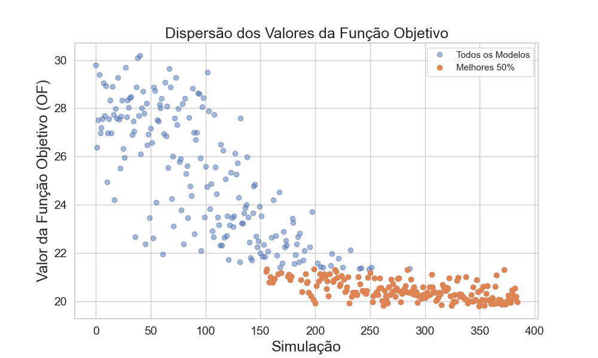
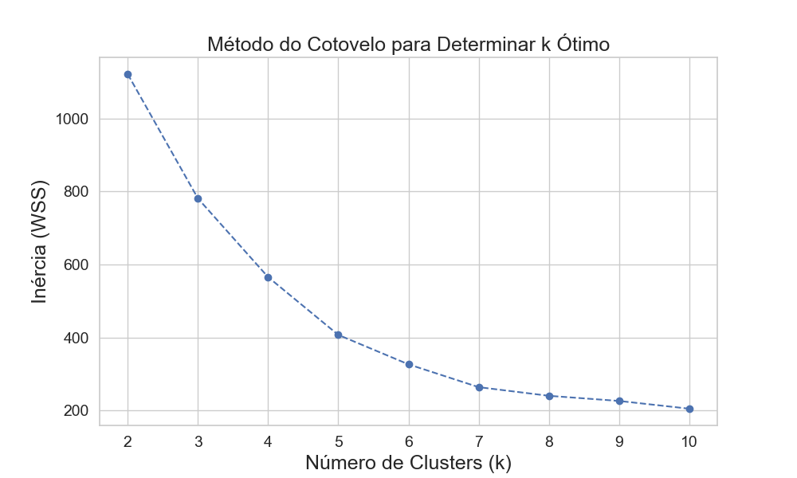
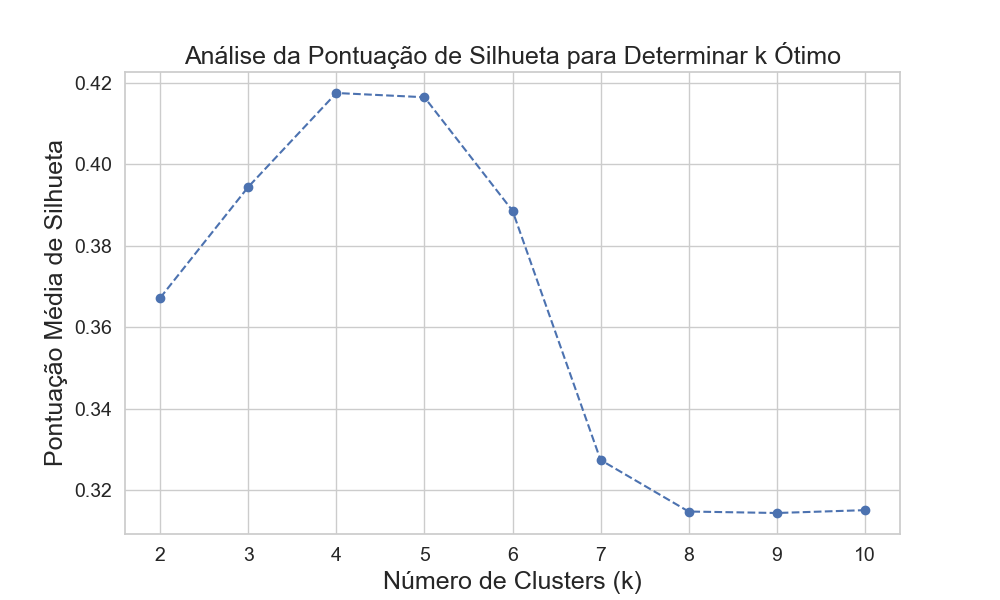
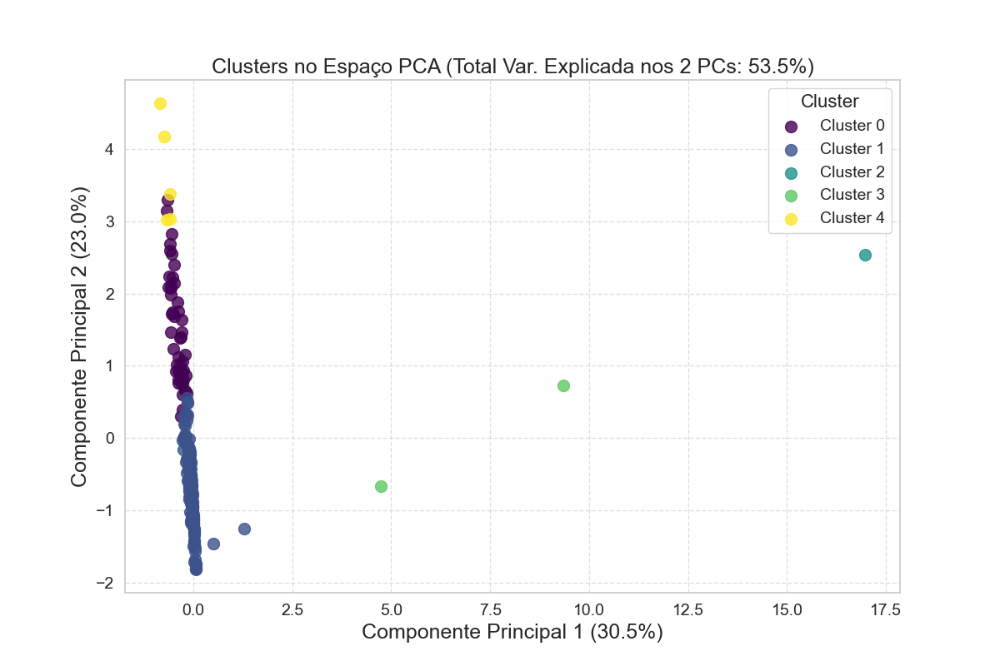
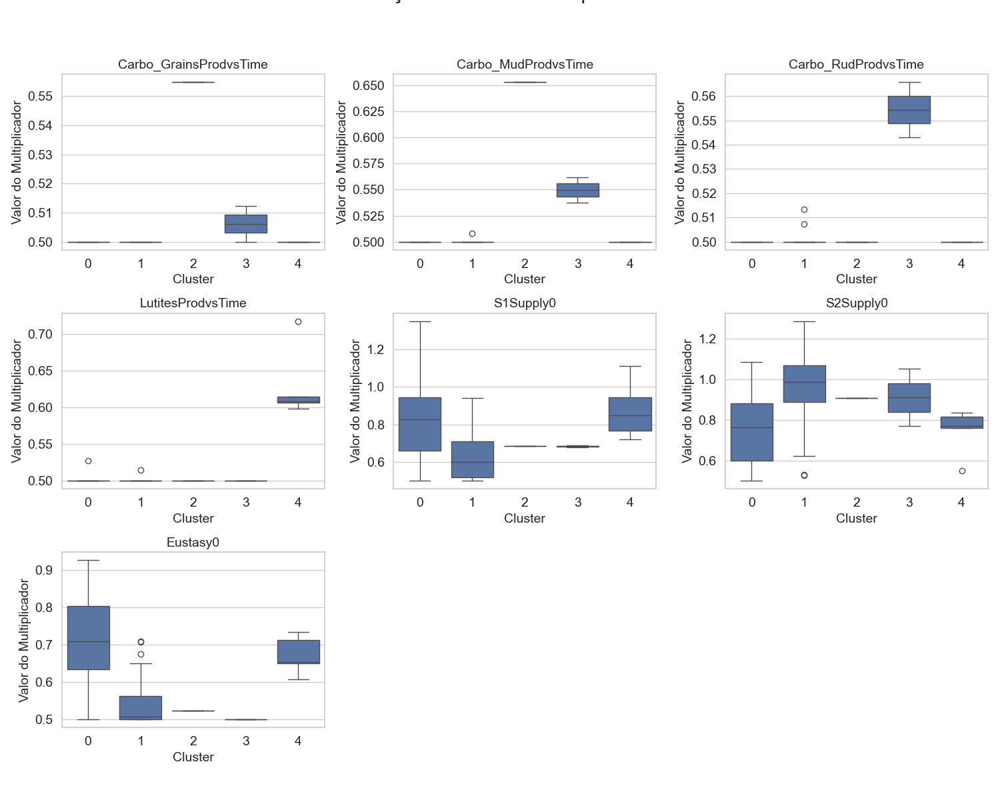
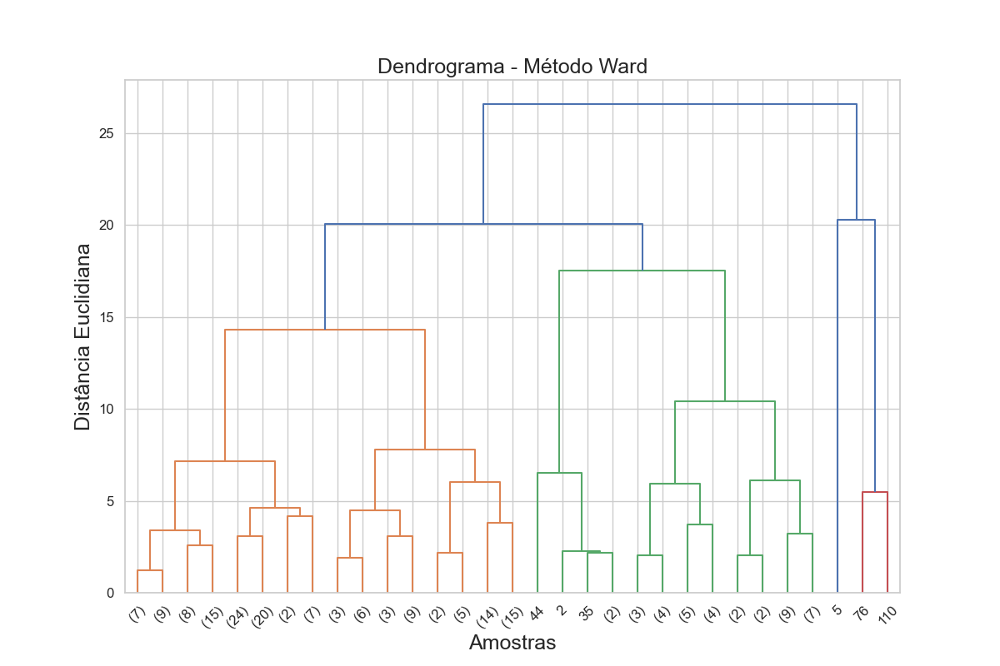
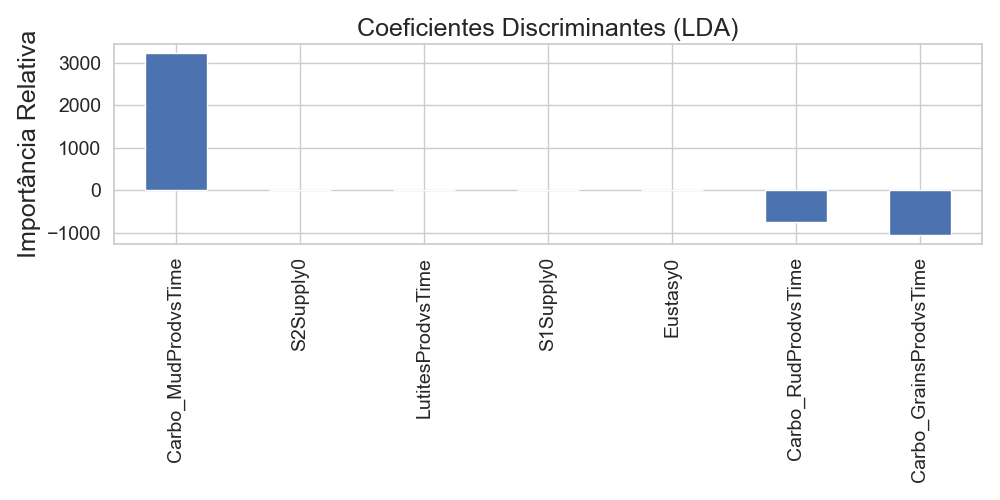

# Relatório de Análise de Calibração

Relatório gerado em: 2025-11-24 17:51:24

Arquivo de entrada: `Uncertain_parameters_and_OF_values.xlsx`

## Resumo das Configurações da Análise

* **Percentil para Melhores Modelos:** 50%
* **Variância Mantida pelo PCA:** 95%
* **Número de Componentes Principais:** 6
* **Número de Clusters (k):** 5

## Seleção dos Melhores Modelos

Total de simulações: 385
Número de modelos selecionados (melhores 50%): 193

*Gráfico 1: Dispersão dos valores da Função Objetivo (OF). Pontos laranjas indicam os modelos selecionados.*

## Determinação do Número de Clusters (k)

Foram analisados valores de k no intervalo: [2, 3, 4, 5, 6, 7, 8, 9, 10]

*Gráfico 2: Método do Cotovelo (Inércia vs. k). O 'cotovelo' sugere um k ótimo.*

*Gráfico 3: Pontuação Média de Silhueta vs. k. Valores mais altos indicam melhor separação dos clusters.*

**Número de clusters escolhido (k): 5**

## Visualização e Análise dos Clusters

*Gráfico 4: Visualização dos 5 clusters no espaço dos dois primeiros Componentes Principais (Total Var. Explicada: 53.5%).*

### Tamanho dos Clusters

|   Cluster |   Número de Modelos |
|----------:|--------------------:|
|         0 |                  49 |
|         1 |                 136 |
|         2 |                   1 |
|         3 |                   2 |
|         4 |                   5 |

### Centróides dos Clusters (Valores Médios dos Parâmetros Originais)

|   Cluster |   Carbo_GrainsProdvsTime |   Carbo_MudProdvsTime |   Carbo_RudProdvsTime |   LutitesProdvsTime |   S1Supply0 |   S2Supply0 |   Eustasy0 |
|----------:|-------------------------:|----------------------:|----------------------:|--------------------:|------------:|------------:|-----------:|
|         0 |                   0.5000 |                0.5000 |                0.5000 |              0.5006 |      0.8197 |      0.7601 |     0.7107 |
|         1 |                   0.5000 |                0.5001 |                0.5001 |              0.5001 |      0.6224 |      0.9652 |     0.5363 |
|         2 |                   0.5550 |                0.6524 |                0.5001 |              0.5000 |      0.6847 |      0.9083 |     0.5229 |
|         3 |                   0.5065 |                0.5484 |                0.5545 |              0.5000 |      0.6837 |      0.9094 |     0.5000 |
|         4 |                   0.5000 |                0.5000 |                0.5000 |              0.6291 |      0.8780 |      0.7460 |     0.6715 |
*Tabela 1: Valores médios dos multiplicadores para cada cluster.*

### Estatísticas da Função Objetivo ('OF Value') por Cluster

|   Cluster |    count |    mean |      std |     min |     25% |     50% |     75% |     max |
|----------:|---------:|--------:|---------:|--------:|--------:|--------:|--------:|--------:|
|         0 |  49.0000 | 20.7753 |   0.3440 | 20.0257 | 20.4461 | 20.8736 | 21.0536 | 21.3174 |
|         1 | 136.0000 | 20.3038 |   0.3349 | 19.7937 | 20.0489 | 20.2684 | 20.4595 | 21.3127 |
|         2 |   1.0000 | 20.9333 | nan      | 20.9333 | 20.9333 | 20.9333 | 20.9333 | 20.9333 |
|         3 |   2.0000 | 20.4708 |   0.1476 | 20.3664 | 20.4186 | 20.4708 | 20.5230 | 20.5752 |
|         4 |   5.0000 | 21.0329 |   0.2380 | 20.7936 | 20.8172 | 21.0017 | 21.2333 | 21.3186 |
*Tabela 2: Estatísticas descritivas do 'OF Value' para os modelos dentro de cada cluster.*

### Distribuição dos Parâmetros por Cluster

*Gráfico 5: Boxplots mostrando a distribuição dos valores de cada parâmetro (multiplicador) dentro de cada cluster.*

## Validação dos Clusters e Análises Avançadas

### Métricas de Validação dos Clusters

#### Kmeans

| Métrica | Valor |
|:--|--:|
| Silhouette | 0.416 |
| Calinski-Harabasz | 108.889 |
| Davies-Bouldin | 0.739 |

#### Hierarchical

| Métrica | Valor |
|:--|--:|
| Silhouette | 0.406 |
| Calinski-Harabasz | 98.271 |
| Davies-Bouldin | 0.741 |

### Clusterização Hierárquica (Método de Ward)

*Gráfico 6: Dendrograma mostrando a hierarquia entre os clusters. Alturas menores indicam grupos mais semelhantes.*

### Análise Discriminante Linear (LDA)

A análise discriminante linear identifica os parâmetros com maior poder de separação entre os clusters formados. Coeficientes positivos e negativos indicam a direção da influência de cada parâmetro.

|                        |   Coeficiente |
|:-----------------------|--------------:|
| Carbo_MudProdvsTime    |     3218.5878 |
| S2Supply0              |       10.7460 |
| LutitesProdvsTime      |        7.9922 |
| S1Supply0              |        1.2009 |
| Eustasy0               |       -3.3423 |
| Carbo_RudProdvsTime    |     -753.1246 |
| Carbo_GrainsProdvsTime |    -1049.3340 |
*Tabela 4: Coeficientes discriminantes médios por parâmetro.*

*Gráfico 7: Importância relativa dos parâmetros na separação dos clusters segundo a LDA.*

### Teste Estatístico de Diferenças entre Clusters (ANOVA)

A ANOVA testa se as médias do valor da Função Objetivo (ou outras variáveis) diferem significativamente entre os clusters.

|            |   sum_sq |       df |        F |   PR(>F) |
|:-----------|---------:|---------:|---------:|---------:|
| C(Cluster) |  10.0268 |   4.0000 |  22.3718 |   0.0000 |
| Residual   |  21.0648 | 188.0000 | nan      | nan      |
*Tabela 5: Resultado da ANOVA aplicada sobre a variável 'OF Value'. p-values inferiores a 0.05 indicam diferença estatisticamente significativa.*

## Seleção dos Modelos Representativos ('Campeões' por Cluster)

A tabela abaixo mostra a simulação com o menor 'OF Value' dentro de cada um dos clusters identificados.

| Simulation_ID   |   Carbo_GrainsProdvsTime |   Carbo_MudProdvsTime |   Carbo_RudProdvsTime |   LutitesProdvsTime |   S1Supply0 |   S2Supply0 |   Eustasy0 |   OF Value |   Simulation |   Cluster |   Cluster_H |
|:----------------|-------------------------:|----------------------:|----------------------:|--------------------:|------------:|------------:|-----------:|-----------:|-------------:|----------:|------------:|
| Sim261          |                   0.5000 |                0.5000 |                0.5000 |              0.5000 |      0.7887 |      0.8509 |     0.6471 |    20.0257 |     261.0000 |    0.0000 |      3.0000 |
| Sim349          |                   0.5000 |                0.5000 |                0.5000 |              0.5000 |      0.6676 |      0.8983 |     0.5000 |    19.7937 |     349.0000 |    1.0000 |      1.0000 |
| Sim163          |                   0.5548 |                0.6530 |                0.5000 |              0.5000 |      0.6847 |      0.9083 |     0.5229 |    20.9333 |     163.0000 |    2.0000 |      5.0000 |
| Sim302          |                   0.5000 |                0.5373 |                0.5430 |              0.5000 |      0.6788 |      1.0508 |     0.5000 |    20.3664 |     302.0000 |    3.0000 |      4.0000 |
| Sim158          |                   0.5000 |                0.5000 |                0.5000 |              0.6149 |      0.7210 |      0.8344 |     0.7332 |    20.7936 |     158.0000 |    4.0000 |      2.0000 |
*Tabela 3: Melhores simulações representativas de cada cluster.*

